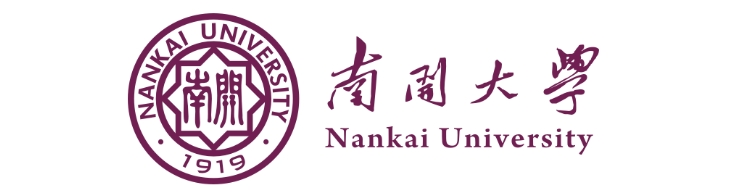

# 构建基于异构嵌入式计算机集群的Serverless框架

## 分工和协作

| 姓名   | 主要负责工作                                                                                      |
| ------ | ------------------------------------------------------------------------------------------------- |
| 王荣熙 | Serverless、k3s和docker的部署及集群调度部分的资源调度等工作。                             |
| 岳志鑫 | NPU 推理部分和视频解码部分的 docker 部署、image 制作、环境配置和相关程序代码编写等工作。 |
| 李嘉爽 | 前端部分鸿蒙系统的部署、APP的开发、仓库的维护和文档撰写等工作。                                               |

## 提交仓库文件描述

```
仓库文件描述
├─ 📁Atlas 200I DK A2
│  ├─ 📁yolov5-infer-cpp
│  │  ├─ 📁acl                             // 华为Ascend AI处理器的ACL（Ascend Computing Language）API
│  │  ├─ 📁lib64                           // 相关库文件
│  │  ├─ 📁model                           // yolov5的om模型
│  │  ├─ 📁src                             // 调用NPU进行推理的程序代码
│  │  ├─ 📄CMakeLists.txt
│  │  ├─ 📄Dockerfile                      // 制作包含所有运行环境和库文件的 docker image 语句 
│  │  ├─ 📄README.md                       // 启动docker的挂载命令和程序接口说明等
│  │  └─ 📄repo.txt                        // 与 dockerfile 配套使用，用于更换 OpenEuler 的 yum 源
├─ 📁DAYU200
│  └─ 📁serverless
│     ├─ 📁APPScore
│     ├─ 📁entry
│     │  ├─ 📁libs                         // 存放OpenCV库文件
│     │  ├─ 📁oh_modules                   // c++与ArkTS代码的绑定库
│     │  └─ 📁src
│     │     └─ 📁main
│     │        ├─ 📁cpp
│     │        │  ├─ 📁common
│     │        │  │  └─ 📄common.cpp       // OpenCV相关代码
│     │        │  ├─ 📁include             // OpenCV相关库文件
│     │        │  ├─ 📁types
│     │        │  ├─ 📄CmakeLists.txt
│     │        │  └─ 📄hello.cpp           // 实现HTTP请求和响应结果处理
│     │        ├─ 📁ets
│     │        │  ├─ 📁enttyability
│     │        │  ├─ 📁pages
│     │        │  │  └─ 📄index.ets        // 前端主要页面代码
│     │        │  └─ 📁util                // 工具类
│     │        └─ 📁resources 
│     │           └─ 📄module.json         // 更改权限代码
│     ├─ 📁hvigor
│     └─ 📁oh_modules
├─ 📁RK3588
│   └─ 📁video_decoder_docker_multiway_v2
│      ├─ 📁src                            //视频解码程序的源代码
│      ├─ 📄Dockerfile                     //制作包含所有运行环境和库文件的 docker image 语句 
│      └─ 📄README.md                      //启动docker的挂载命令和程序接口说明等.
├─ 📁fission                               //所使用的开源 Serverless 框架 fission
├─ 📁image                                 //存放README中使用的资源
├─ 📁k3s-master                            //所使用的 k3s 开源代码
├─ 📁test                                  //系统测试相关代码和数据
│   ├─ 📄README.md
│   ├─ 📄test.py                           //对系统的各部分延迟进行测试的代码
│   ├─ 📄单线程与多线程对比.csv               //原数据
│   ├─ 📄单线程数据.csv
│   ├─ 📄容器启动时间(优化后).xlsx
│   ├─ 📄容器启动时间(优化前).xlsx
│   ├─ 📄容器启动时间对比.xlsx
│   └─ 📄多线程数据.csv
├─ 📁yolov5-infer-k3s-deploy               //yolov5-infer 程序在 k3s 集群中部署
│   └─ 📁tuili
│      ├─ 📄_init_.py                      
│      ├─ 📄build.sh                       //执行pip安装依赖库                    
│      ├─ 📄requirements.txt               //需要安装的依赖库                            
│      └─ 📄user.py                        //启动pod的faas函数                   
├─ 📄README.md                             //简要说明文档
└─ 📄集群调度问题解决问题.md                  //针对部署Serverless、k3s和docker的相关问题的解决方案.
```

集群调度问题解决:[问题说明文档](https://gitlab.eduxiji.net/T202410055992538/project2210132-240344/-/tree/main/集群调度问题解决问题.md)

在k3s中部署Yolov5程序:[k3s部署](https://gitlab.eduxiji.net/T202410055992538/project2210132-240344/-/tree/main/yolov5-infer-k3s-deploy)

前端部分代码:[前端项目：Serverless](https://gitlab.eduxiji.net/T202410055992538/project2210132-240344/-/tree/main/DAYU200/serverless)

NPU推理部分代码:[NPU推理项目：yolov5-infer-cpp](https://gitlab.eduxiji.net/T202410055992538/project2210132-240344/-/tree/main/Atlas%20200I%20DK%20A2/yolov5-infer-cpp)

视频解码部分代码:[视频解码项目：video_decoder_docker_multiway_v2](https://gitlab.eduxiji.net/T202410055992538/project2210132-240344/-/tree/main/RK3588/video_decoder_docker_multiway_v2)


## 目标描述

我们希望在一个异构的 SBC 集群上构建一套轻量化的、满足物联网应用需求的 Serverless 服务框架，为智能物联网设备提供各种计算服务。通过将 Serverless 计算与异构SBC集群结合，我们不仅可以更好地管理和分配计算资源，还能够应对各种复杂的新型应用需求，实现更灵活的部署和更高效的计算服务。这种新型的 Serverless 架构能够充分利用异构计算资源的优势，在提高计算效率和降低功耗的同时，提供更强大的功能支持，使得边缘计算在物联网场景中的应用更加广泛和高效。

我们的设计基于Serverless 框架，将其与嵌入式开发板结合，形成一个异构嵌入式集群。通过Serverless的调度方式，它可以获取异构嵌入式集群内不同开发板的的硬件资源，并根据任务的不同需求选择不同的资源进行分配，任务量较多的情况下可以启动开发板上的多个docker容器运行程序。针对于设计的Serverless框架，我们使用了一个图像识别应用来进行可行性验证。该应用在异构嵌入式集群环境下以Serverless的方式运行，利用异构集群处理识别多个视频设备产生的视频流。异构集群包括负责前端的 DAYU200 开发板，负责后端调用 NPU 进行推理的 QA200A2 Atlas200I DK A2开发板，负责视频解析的讯为 iTOP-3588 开发板，以及部署了 Serverless  的用于集群调度的 Atlas 200I DK A2 开发板。每个开发板上都部署了k3s，便于Serverless的统一调度。

## 题目分析

虽然目前大型服务器集群仍然是处理高性能计算（HPC）、大数据分析、数据库服务和企业级应用等场景的主流解决方案。但是 SBC 集群相比传统数据中心具有占地面积小、功耗低、成本低的优势，且能够灵活部署在边缘设备上，实现实时响应的物联网应用。利用多个异构的单板计算机构建一个小型的数据中心，提供边缘计算能力，并在 SBC 集群上构建一套轻量化的 Serverless 服务框架以提供计算服务是一个崭新的方向，要实现跟大型服务器集群相同的处理能力仍旧是一个不小的挑战。我们要组成实际的 Serverless 服务原型框架，可运行在单板计算机集群上，并根据应用需求在集群内部实现自动化资源调度和任务分配，性能开销合理、稳定性高、能够满足物联网应用的各类需求。

- 使用多个（不少于3个）不同类型的嵌入式开发板，通过网络交换机或者网络交换芯片，组建成一个异构的SBC集群，并成功部署任意一款Serverless框架，能够正常调度使用板子上的各种计算资源（CPU、NPU、GPU、FPGA、DPU等）。
- 实现前后端分离，选择集群中的一块开发板作为前端，其他开发板作为后端算力支撑，在前端开发板上部署一个安卓或鸿蒙系统，要求能够在前端通过调用Serverless接口调用后端提供的各种计算服务，例如各类AI功能（CV、NLP）或者额外的CPU资源。
- 优化Serverless框架的各类指标，例如容器启动时间、系统吞吐量、应用响应延迟等。
## 系统框架设计
我们的异构集群内包含多种运算资源，为了应用Serverless框架，后端每一个开发板都部署k3s系统和docker容器，便于Serverless系统迅速的进行任务分配和资源调度。使用一个图像识别应用，接收多个视频设备传入的视频，分别通过视频解码和图像推理识别的过程，最后用一个开发板作为前端进行展示。使用压力测试检测Serverless框架是否能迅速合理分配视频解码任务和识别任务，计算容器启动时间、系统吞吐量、应用响应延迟和各个部分的负载均衡等指标，观察其是否具有高效的管理和调度机制对接收到的任务进行预测或分类，并为每个任务找到最合适的硬件执行器。

- 前端部分：DAYU200开发板部署Open Harmony 4.0 Release 和k3s系统，开发一个前端程序向视频解码部分获取后端数据并可视化显示在屏幕上。
- 集群调度部分：Atlas 200I DK A2开发板安装 k3s。k3s 将 docker 作为容器运行，Serverless 则选择使用 fission，并部署在 k3s 集群上，调度NPU推理部分和视频解码部分的POD。
- 推理部分：QA200A2 Atlas200I DK A2开发板部署 OpenEuler 22.03 LTS SP1 和k3s系统，接收视频解码部分发送的HTTP 请求后由k3s拉起docker并运行推理程序进行推理，将推理结果返回给视频解码部分。
- 视频解码部分：iTOP-3588 开发板部署 OpenEuler 22.03 LTS SP1 和k3s系统，由k3s拉起docker 容器，在容器内内部署多路解码程序，将收到的视频设备的视频解码为帧图像发送给NPU推理部分，将NPU推理部分返回的结果传输给前端部分。

具体系统框架设计如下图所示：

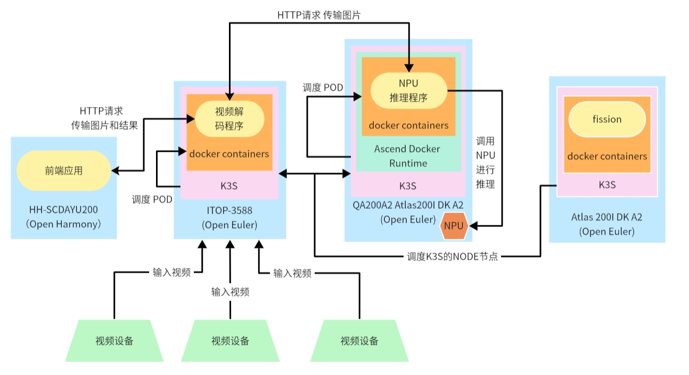

系统整体情况如图所示：

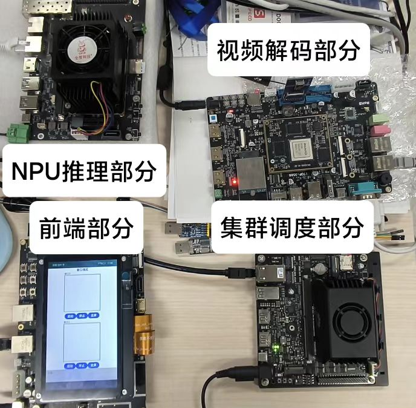

## 开发流程

### 前端部分

使用搭载了 Rockchip RK3568 芯片的润和 HH-SCDAYU200 开发板作为前端开发板。在此开发板上部署鸿蒙系统，开发一个前端显示程序。

具体步骤如：发送 HTTP 请求获取结果，将获取的结果拆分为推理结果和图像数据。利用鸿蒙开发的 ArkTS 和Native C++ 将图像数据转为图片显示在 Canvas 画板上，将推理结果内的坐标、标签、概率等属性绘制成矩形框显示在画板上，通过不断发送 HTTP 请求和刷新画板，最终实现视频的效果。同时开发多线程，保证多窗口场景下的高效性。具体前端部分流程如图所示：

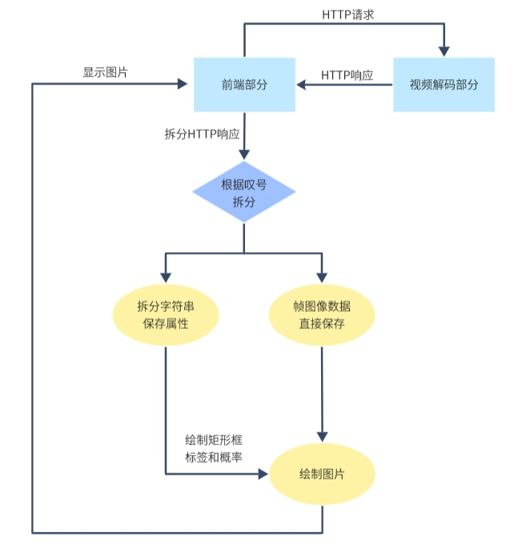

### 集群调度部分

使用 Atlas 200I DK A2 开发者套件部署 k3s 等系统，对接收的信息进行分析，并调用合适的系统进行资源调度。

具体步骤如：使用 docker 容器，部署 k3s 系统，当 docker 作为容器运行时，借助 fission 实现可视化，通过判断当前系统的负载来调度不同的 POD，包括但不限于启动多个 NPU 推理开发板、视频解码开发板作为NODE或启动单个开发板上的多个 POD。具体集群调度部分流程如图所示：

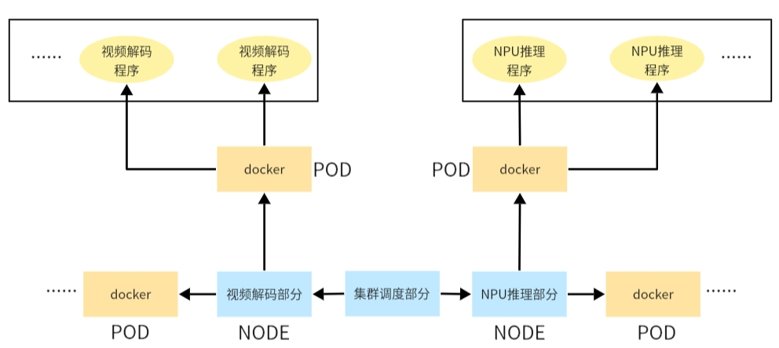

### NPU推理部分

使用 QA200A2 Atlas200I DK A2开发者套件  开发者套件部署 docker 并利用容器进行 NPU 推理。

具体步骤如：使用 Yolov5 模型编写一个 C++ 推理程序。首先从文件中读取图像数据，使用 OpenCV 创建图像矩阵 img，调用华为 Ascend AI 处理器的 ACL（Ascend Computing Language）API交互，用于模型的初始化、加载和执行，然后调用 Yolov5 的模型进行推理，并输出最后的检测信息，设置 HTTP 服务器和多线程保证有效的传输和推理。具体NPU推理部分流程如图所示：

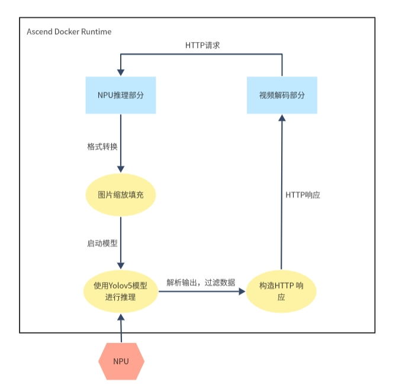

### 视频解码部分

使用搭载了 Rockchip RK3588 芯片的迅为iTOP-3588开发板，在此开发板上开发一个容器内的多线程解析视频的视频流处理系统。

具体步骤如：使用 httplib 库创建 HTTP 服务器，使用 FFmpeg 库来完成初始化网络、打开视频流、查找视频流信息、打开解码器和创建缩放上下文等工作，将最后转换出的格式使用 HTTP 传输，设置多线程保证任务量集中时仍能保持高效的视频解码处理。具体视频解码部分流程如图所示：

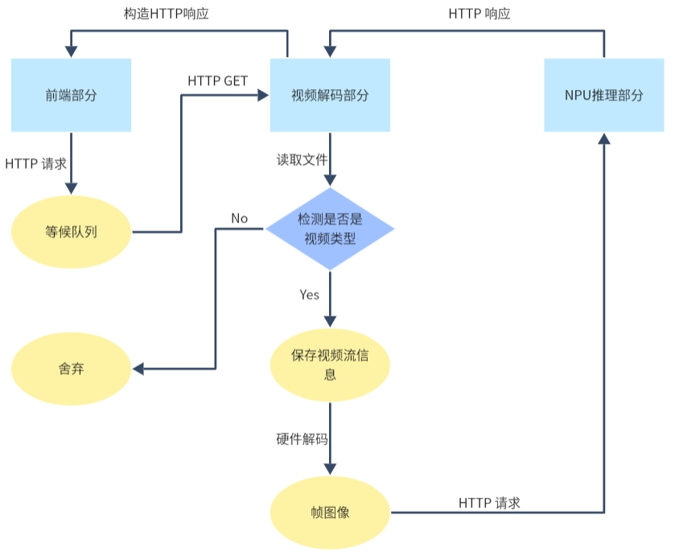

如下图所示，各个部分之间通过 Serverless框架进行数据传输和调用，形成了完整的嵌入式集群系统。视频解码部分将视频流拆分成图像帧，并传输给 NPU 推理部分进行处理。推理结果返回给视频解码部分后，通过前端部分进行可视化显示。集群调度部分则在后台进行资源管理、负载均衡和各个部分的数据传输，确保系统在高负载情况下依然能够高效运行。

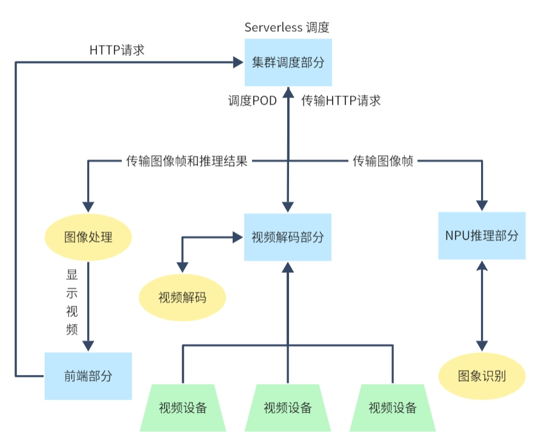

## 比赛过程中的重要进展

### 1. 前端开发板

使用 open Harmony 进行前端开发，采用基于 api9 的 ArkTS Stage 模型。

帧图像数据和推理结果由 HTTP 响应的 body 传输，定义格式为 推理结果 +!+ 帧图像数据。通过"!"对响应进行分割，推理结果转成字符串保存，将字符串内的属性进行拆分得到图像框的坐标、概率和标签的数据，帧图像数据经过格式转换后直接生成图片，由 Canvas 进行绘制，连续的 HTTP 请求带来的连续图像则显示成视频。通过 @ohos.request 和 @ohos.net.http 模块中的接口实现 HTTP 传输，通过 @ohos.multimedia.image 实现图片的生成和绘制。

<div style="display: flex; gap: 10px;">
  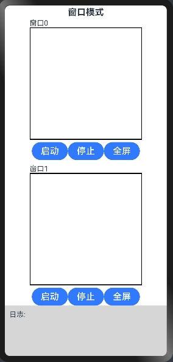
  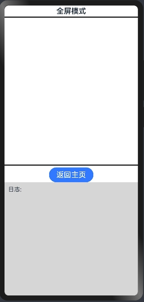
</div>

前端程序函数调用关系如下：

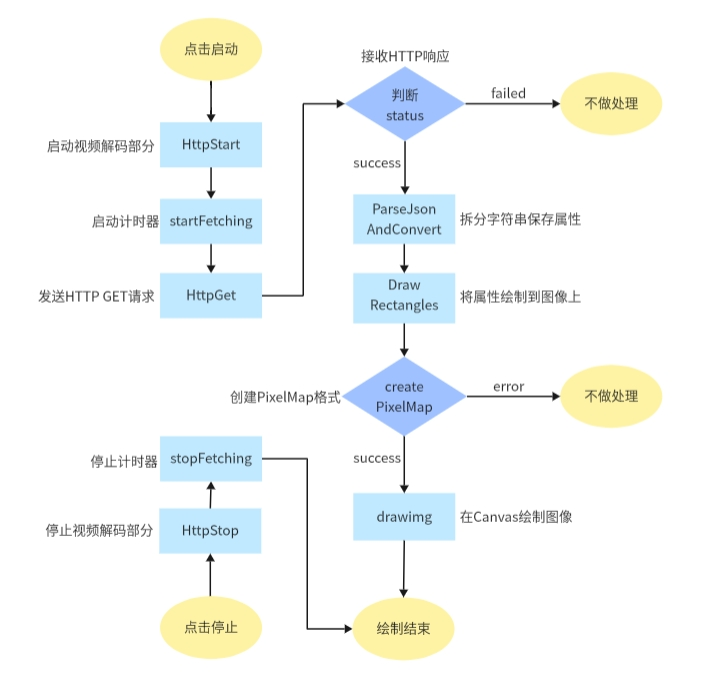

### 2. 集群调度开发板

使用 Atlas 200I DK A2 开发者套件部署 Serverless和k3s 等系统，利用 docker部署Fission ，并调度不同的 POD。

#### 部署 docker

直接使用指令 `yum install -y docker 进行 docker` 进行 docker 的部署。

国内使用 docker 需要换源。使用的指令如下：

```shell
# 修改配置文件
vim /etc/docker/daemon.json

# 修改的内容
{
    "registry-mirrors":[
       # 使用的镜像源
    ]
}

# 重启 docker 以及 daemon
systemctl daemon-reload
systemctl restart docker
```

#### 部署 k3s

首先使用如下指令，在 server 端部署 k3s：

```shell
curl -sfL https://rancher-mirror.rancher.cn/k3s/k3s-install.sh | \
  INSTALL_K3S_MIRROR=cn \
  K3S_TOKEN=12345 sh -s - --docker \
  --system-default-registry=registry.cn-hangzhou.aliyuncs.com
```

然后使用如下指令在 node 端部署 k3s：

```shell
# server端
cat /var/lib/rancher/k3s/server/node-token
ifconfig

# node端
curl -sfL https://rancher-mirror.rancher.cn/k3s/k3s-install.sh | \
  INSTALL_K3S_MIRROR=cn \
  K3S_TOKEN=mynodetoken \
  sh -s - server --docker \
  --server https://myserver:6443 \
  --system-default-registry=registry.cn-hangzhou.aliyuncs.com
```

运行结束后，即可将 node 加入 k3s 集群。

注意 server 和 node 的时间必须一致。

之后，使用如下 yaml 文件的内容进行 pod 调度测试：

```yaml
apiVersion: v1
kind: Pod
metadata:
  name: test1
  labels:
    env: test
spec:
  nodeName: node1
  containers:
  - name: nginx
    image: nginx:latest
    imagePullPolicy: IfNotPresent
```

#### 部署 Serverless（fission）

我们使用的 k3s 没有安装 helm，所以我们使用如下指令进行 serverless（fission） 的部署：

```shell
# Without helm
kubectl create -k "github.com/fission/fission/crds/v1?ref=v1.20.1"
export FISSION_NAMESPACE="fission"
kubectl create namespace $FISSION_NAMESPACE
kubectl config set-context --current --namespace=$FISSION_NAMESPACE
kubectl apply -f https://github.com/fission/fission/releases/download/v1.20.1/fission-all-v1.20.1.yaml
kubectl config set-context --current --namespace=default #to change context to default namespace after installation

# Install Fission CLI
curl -Lo fission https://github.com/fission/fission/releases/download/v1.20.1/fission-v1.20.1-linux-arm64 \
    && chmod +x fission && sudo mv fission /usr/local/bin/
```

之后使用如下指令检测 fission 是否启动成功：

```shell
kubectl get pod -A
```

之后需要为 fission 安装编程语言的环境，比如 Golang、Python3 和 Node.js。

```shell
# 安装 Python3
docker pull fission/python-env
fission environment create --name python --image fission/python-env

# 安装 Node.js
docker pull fission/node-enc
fission environment create --name nodejs --image fission/node-env

# 安装 Golang
docker pull fission/go-env-1.22
docker pull fission/go-builder-1.22
fission environment create --name go --image fission/go-env-1.22 --builder fission/go-builder-1.22
```

部署成功后即可进行访问fission

### 3. NPU 推理开发板

#### 采用 Ascend Docker Runtime 进行容器化支持

Ascend Docker Runtime（又称 Ascend Docker，又称昇腾容器运行时）是 MindX DL 的基础组件，用于为所有的训练或推理作业提供昇腾 AI 处理器（Ascend NPU）容器化支持，使用户 AI 作业能够以 Docker 容器的方式平滑运行在昇腾设备之上，Ascend Docker Runtime 逻辑接口如图所示

部署参考[异腾社区-官网-Ascend Docker Runtime](https://www.hiascend.com/document/detail/zh/mindx-dl/500/dockerruntime/dockerruntimeug/dlruntime_ug_005.html)


#### 调用 NPU 设备进行推理

根据 Yolov5 模型使用 C++ 制作了一个图像推理程序。便于NPU推理开发板接收视频解码开发板提供的图像并调用容器内部的推理程序进行分析。程序框架内提供HTTP接口支持，使用华为在昇腾平台上开发深度神经网络推理应用的C语言API库AscendCL，其能提供运行资源管理、内存管理、模型加载与执行、算子加载与执行、媒体数据处理等API，能够实现利用昇腾硬件计算资源、在昇腾CANN平台上进行深度学习推理计算、图形图像预处理、单算子加速计算等能力。此外还借助OpenCV库和yolov5模型将图像进行推理，将推理结果填充HTTP响应后返回。

AscendCL参考：[AscendCL架构及基本概念](https://www.hiascend.com/document/detail/zh/Atlas200IDKA2DeveloperKit/23.0.RC2/Application%20Development%20Guide/aadgc/aclcppdevg_0003.html)

NPU推理程序函数调用关系如下：

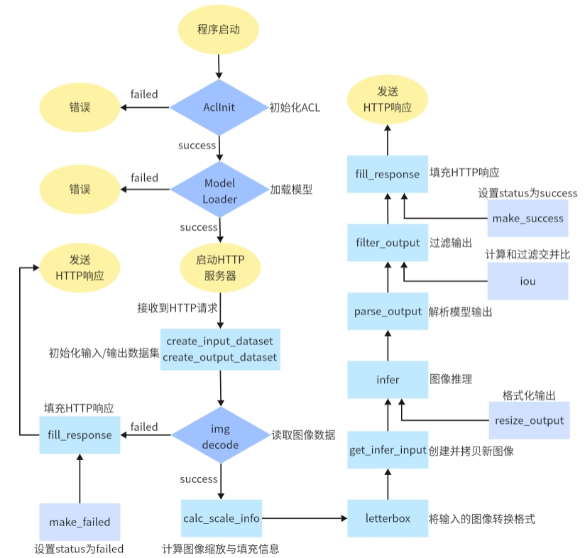

### 4. 视频解码开发板

#### 调用视频解码开发板进行解码

使用 C++ 编写视频解码程序，框架内提供 HTTP 接口支持。接收到视频设备传输的视频后，使用自身硬件解码的方式将视频流解码成帧图像，再传输给 NPU 推理开发板，接收到前端开发板的HTTP 请求后，会先将请求放入队列，如果接收到NPU推理开发板的返回结果后从队列中选出最新存入的HTTP请求，并将推理结果和帧图像数据传输给前端开发板。如果队列中存在等待超过500 ms 的HTTP请求，会将failed返回，并移出队列。

视频解码程序函数调用关系如下：

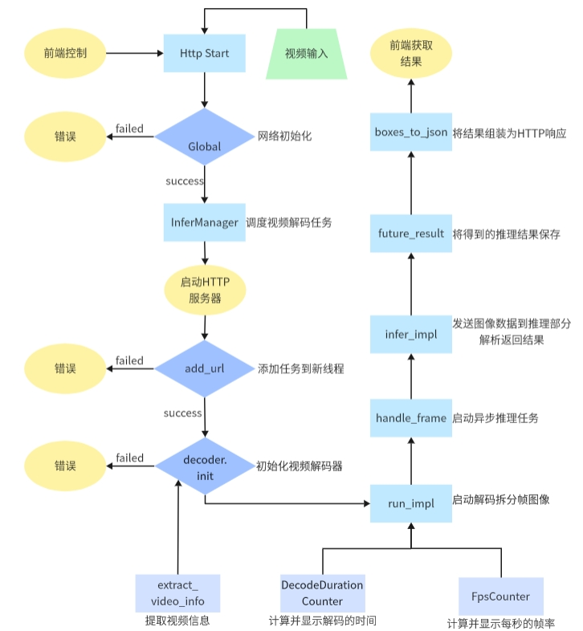

## 系统测试情况

### 1. 前端部分

前端 APP 选择窗口点击启动按钮发送HTTP/start请求，Serverless系统调度视频解码开发板创建容器，启动视频解码程序。前端会自动循环发送HTTP Get请求获取帧图像的数据，并转换为图片的格式，使用Canvas不断把接收到的HTTP 响应的帧图像绘制在对应的窗口区域实现视频效果，点击放大按钮可以观看单个窗口的大屏显示情况。

前端显示测试(GIF)：


多线程测试视频：[https://gitlab.eduxiji.net/T202410055992538/project2210132-240344/-/blob/main/image/video.mp4](https://gitlab.eduxiji.net/T202410055992538/project2210132-240344/-/blob/main/image/video.mp4)

经过测试发现虽然图像识别应用在异构集群内能够运行起来，但是多线程性能不够理想，前端页面HTTP/start请求延迟较大，需要等待5000-6000ms才能启动视频解码部分并获取返回结果。计算系统启动一分钟时间内产生的单线程的1570组数据和多线程的1214组数据后，得出单线程时系统Http GET 请求所需时间为34.002 ms，多线程时系统HTTP GET 请求所需时间为42.771 ms。但由于UI线程绘制的数据量较大导致的卡顿延迟，所以多线程情况下获取后端HTTP响应的数据并显示在屏幕上的视频性能也无法达到预期的30帧，而是只有20帧左右，还有提升和优化的空间。

测试数据见：[单线程与多线程测试数据](https://gitlab.eduxiji.net/T202410055992538/project2210132-240344/-/tree/main/test)

由于数据量较大，我们选取了其中一百组的数据，单线程与双线程HTTP GET请求所用时间对比如图所示，可见多线程时HTTP GET 请求时间波动更为剧烈，耗时也更高，由于前端渲染图片仍然需要时间，所以系统整体传输时间还会增加，多线程时便会出现系统卡顿的问题：

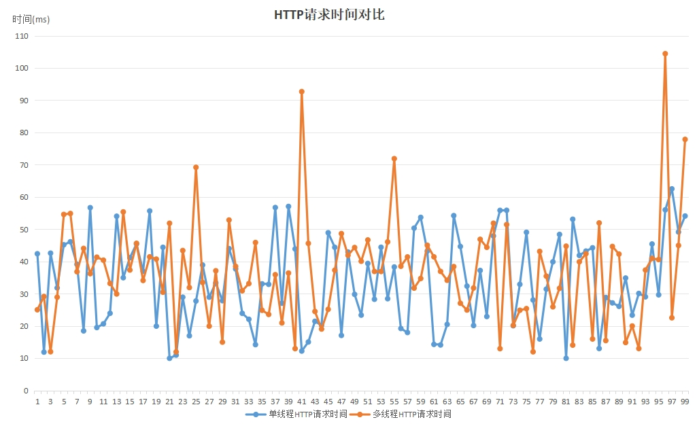

### 2. 集群调度部分

集群调度部分接收到前端发送的请求后，由 fission 触发相应的函数调用，随后 k3s 集群根据当前的负载均衡情况进行评估，选择合适的节点来创建相应的 Pod 和容器，以执行视频解码和图片推理任务。完成图片推理后，结果会被返回至前端进行展示。这一过程中，fission 负责无缝触发函数，k3s 集群则通过智能调度机制确保资源的最佳利用和任务的高效执行，确保整个流程的高效性和响应速度。推理容器正常运行效果示意图如图

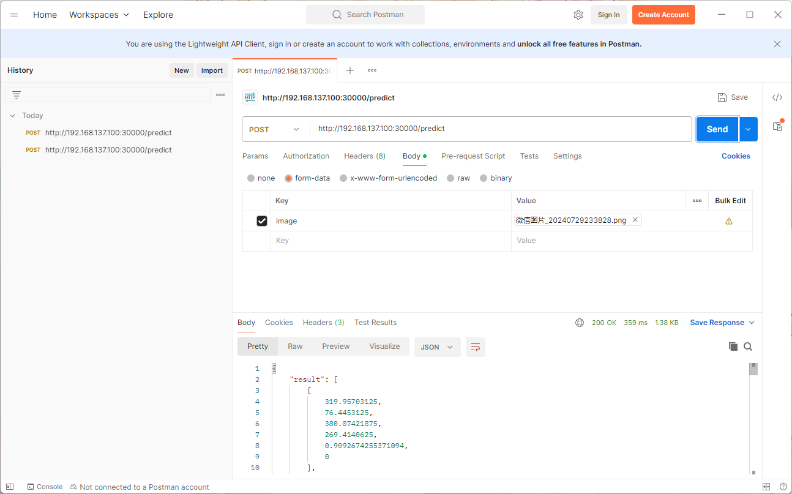

测试启动容器时间如图:

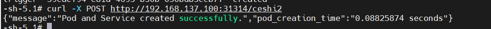

经过计算一百次启动时间的数据发现优化前的容器启动时间为102.550ms，优化后的容器启动时间为90.725ms，优化后的容器启动时间低于优化前的容器启动时间，且波动情况减少，系统启动更为稳定。

测试数据见：[容器启动时间测试数据](https://gitlab.eduxiji.net/T202410055992538/project2210132-240344/-/tree/main/test)

优化后启动时间如图:

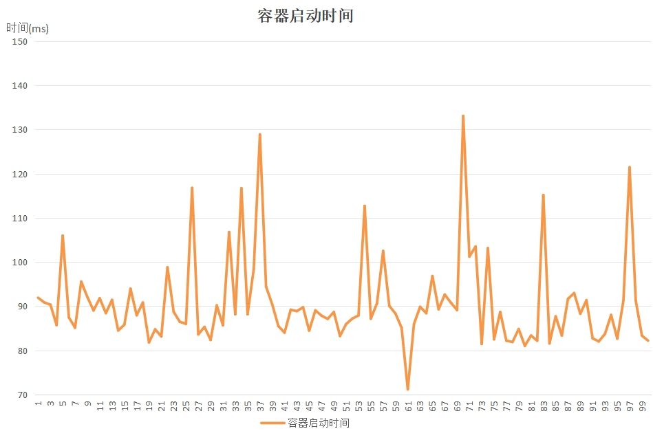

容器启动时间对比如图:

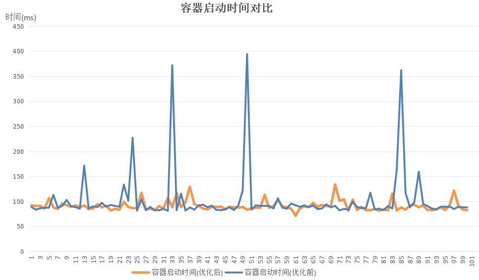

### 3. NPU推理部分
集群调度部分拉起NPU部分的容器时便会自动启动NPU推理程序，将视频解码部分的图片请求自动分配给NPU开发板的容器对帧图像进行推理，将帧图像的推理结果返回给视频解码开发板。计算系统启动一分钟时间内产生的单线程的1570组数据和多线程的1214组数据后，得出单线程帧图像的推理时间和HTTP传输时间为46.718 ms，多线程帧图像的推理时间和HTTP传输时间为57.755ms。

测试数据见：[单线程与多线程测试数据](https://gitlab.eduxiji.net/T202410055992538/project2210132-240344/-/tree/main/test)

HTTP传输日志显示如下:


推理结果显示如下：


推理显示日志如下，其中每隔1s输出当前接收到的HTTP请求总数量，可以看出单线程时每一秒接收约30个请求，多线程时每一秒接收约60个请求，符合两个线程对30帧视频图像的处理：
<div>
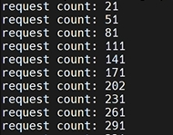
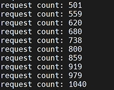
</div>

部署容器如下：

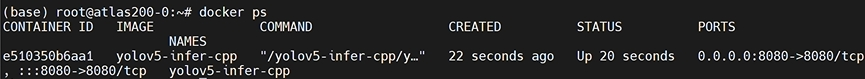

由于数据量较大，我们选取了其中一百组的数据，单线程与双线程推理所用时间对比如图所示，可见多线程时推理时间波动更为剧烈，耗时也更高。由于我们采取了发送完图像帧后直接发送下一帧图像进行推理的方式，我们无需关心上一帧是否推理结束，所以不会因为推理时间延长而导致卡顿的出现。多线程造成的影响只限于第一帧图像返回会耗时略久一些，但之后的图像帧不会存在连续性问题，所以仍然满足我们的推理需求：

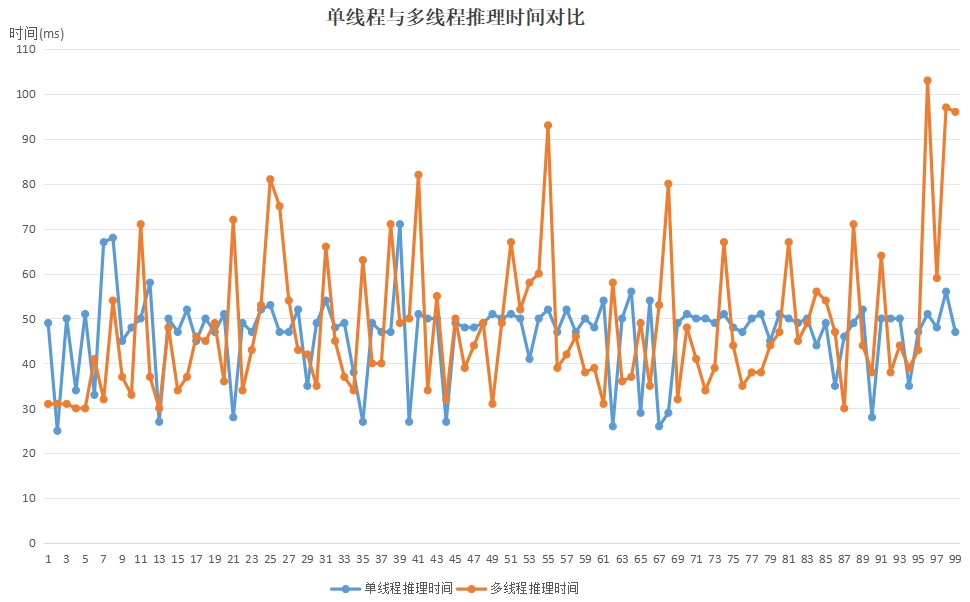

### 4. 视频解码部分
集群调度部分在接收到前端部分发送的HTTP/start请求后拉起视频解码部分的docker容器，启动视频解码程序，将接收到的视频流拆分成帧图像，并将每一个帧图像发送给NPU推理部分，将推理的结果返回给前端部分。经过测试得到每一帧的解码时间在7.5 ms左右，计算系统启动一分钟时间内产生的单线程的1570组数据和多线程的1214组数据后，得出单线程视频解码的时间为19.460 ms，多线程视频解码的时间为22.528ms。

测试数据见：[单线程与多线程测试数据](https://gitlab.eduxiji.net/T202410055992538/project2210132-240344/-/tree/main/test)

视频解码部分日志显示如下，如图所示是仅解码所需时间及当前FPS，约为7.5ms。

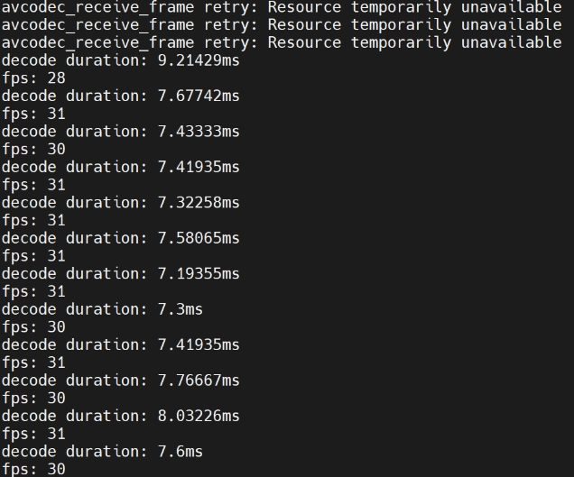

下图日志输出的时间是解码时间和HTTP传输时间的总和及当前FPS。其中单线程解码时可见输出后缀均为camera\_test1，解码和HTTP传输时间为32ms左右，多线程解码时可见输出后缀为camera\_test1和camera\_test2的日志交替出现，解码和HTTP传输时间仍旧为32ms左右，所需时间大部分是HTTP传输时间：

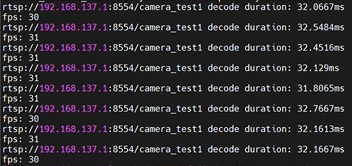
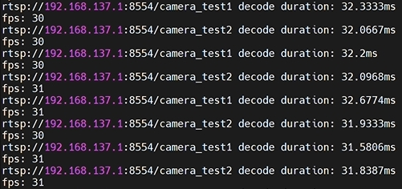

部署容器如下：

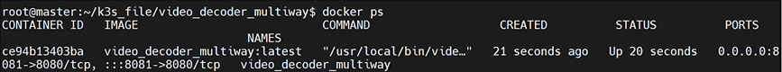

由于数据量较大，我们选取了其中一百组的数据，单线程与双线程解码视频所用时间对比如图所示，可见单线程和多线程处理视频时的波动状态较为一致，视频解码部分的性能较为稳定，可以满足高并发任务时处理视频的请求。

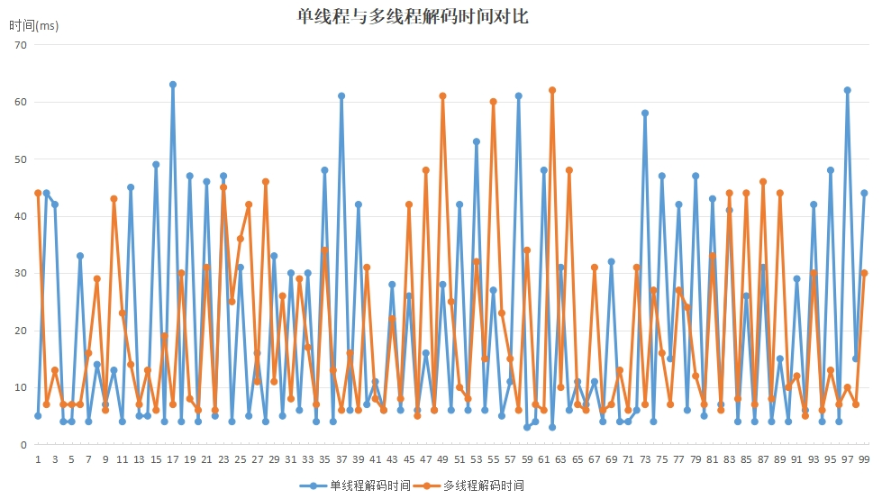

## 比赛总结与未来方向

项目主题是构建异构嵌入式计算机集群的 Serverless 框架。我们成功实现了使用多个不同类型的嵌入式开发板，通过网络交换机组建成一个异构的SBC集群，并成功部署Serverless框架———fission。fission能够正常调度使用板子上的CPU和NPU等计算资源。也实现了前后端分离，选择集群中的DAYU200开发板作为前端，其他开发板作为后端算力支撑，在前端开发板上部署鸿蒙系统，能够在前端通过调用Serverless接口调用后端提供的NPU推理服务。

但在整个系统的实现和实际应用方面，我们还存在如下问题：

- 前端的HTTP接口请求延迟较高，导致我们的系统启动耗时较长
- 前端的UI线程绘制存在性能不足的问题，导致我们的视频不够流畅，无法达到预定的30帧。
- 需要优化Serverless框架的镜像启动时间、系统吞吐量、和容器响应延迟等。

未来的工作重点在于如何优化前端部分负载和集群调度部分的调度效率：

- 初步想法是在C++端发送HTTP请求和利用OpenCV库，将多线程的帧图像数据拼接在一张大图像上，在前端的UI线程只需要绘制一张大图，不断刷新便可以实现大图的30帧视频流，大图内分别是四个线程的图像拼接，所以也是四个小窗口的30帧视频流。关键的核心在于需要设置一个阈值来决定接收多少线程图像后就进行大图的拼接并传递给UI线程进行绘制，因为可能有的线程并未利用或视频传输已结束，所以不能一直等待四个窗口的图像都传入。
- 要处理多线程HTTP请求可能乱序的问题，所以需要对每个线程设置一个句柄，使用异步方法获取future result再进行处理。
- 放大按钮的逻辑更改为点击按钮，只监听对应窗口的线程进行绘制或将大图的结果再拆分出对应窗口的小图进行全屏显示。
- 编写Serverless框架的辅助代码，以帮助Server节点更好的掌控Node节点的负载状态，及时对任务进行分配，对计算资源进行调度，降低系统的延迟和错误率。

## 比赛收获

在参加这次比赛之前，大家认为对操作系统的理论知识有了一定的掌握，并且对操作系统领域充满热情，这是大家最初决定参赛的动力。然而，当项目真正开始进展时，团队对嵌入式开发板的具体开发流程才有了更为直观的认识，我们所需要做的并不是书本上的理论知识的应用，而是现实中与操作系统的真正交互，所以在开发的过程中出现很多奇怪的错误和未知的报错，每个问题也并不是根据书本知识就能解决的，这正是实际开发中所要面对的挑战。项目的开发也是对科研创新过程的体验，在科研的路上并没有那么多的参考资料，不能在网络上随便就能找到答案，我们要做的是从头开始，一步一个脚印，完成一个小目标之后再朝着下一个小目标前进。这种认识与之前的预想存在明显的差异，使得大家对嵌入式操作系统和Serverless框架的研究更加具有好奇心，对知识的理解也更加深刻和理解。

在系统逐渐实现的过程中，每当一块开发板加入到集群中，我们都充满了喜悦，不仅仅是为系统的丰富和扩展感到激动，更是为自己成功完成了一项任务而感到兴奋。虽然大家已经在嵌入式开发板的实际操作上获得了极大的提升，但在后期实际应用中还是遭遇了许多预料之外的问题。在这些问题的解决过程中，我们展现出了极强的学习能力和团队协作精神。每一个技术难题的解决，都是对本科阶段理论知识的一次实践检验，也是实际技能的一次重要提升。在了解和应用异构计算、SBC集群和 Serverless 框架等方面也取得了显著进展。这些都是在本科学习过程中较少接触的新技术领域，随着项目的深入，我们逐渐掌握了这些技术的核心概念和应用方式。通过不断的学习和探索，也成功地将这些先进技术融入到项目开发中，极大地提高了项目的技术水平和创新性。

经过这次比赛的磨练，我们拓展了对于操作系统的认识，明白了操作系统并不只是书本上的枯燥的知识和前人想出来的系统结构，而是应用在生活方方面面的与我们息息相关的伟大技术成果。我们不仅在技术层面获得了丰富的实践经验，也在解决实际问题和团队合作方面获得了宝贵的经验。这些经验将为大家未来的学术研究或职业发展提供坚实的基础。无论比赛结果如何，这段经历都将成为团队成员宝贵的财富，对未来的发展产生深远的影响。
