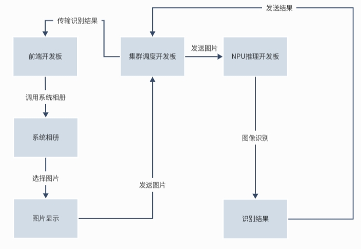
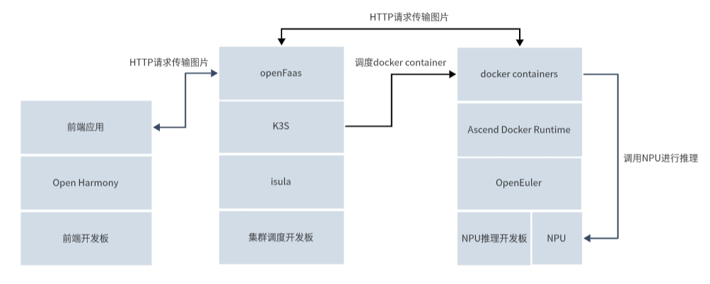
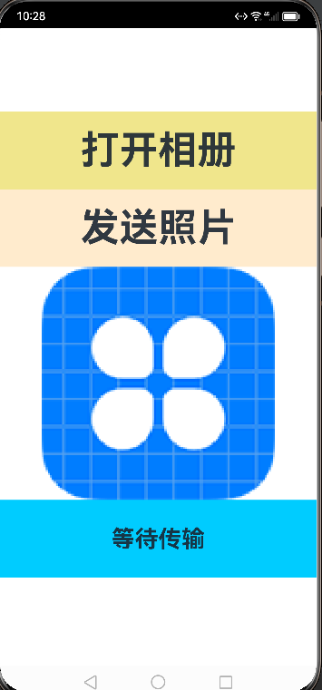
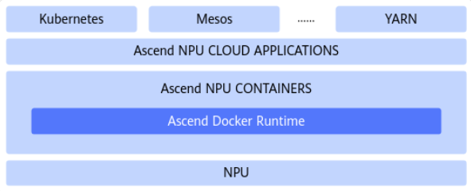
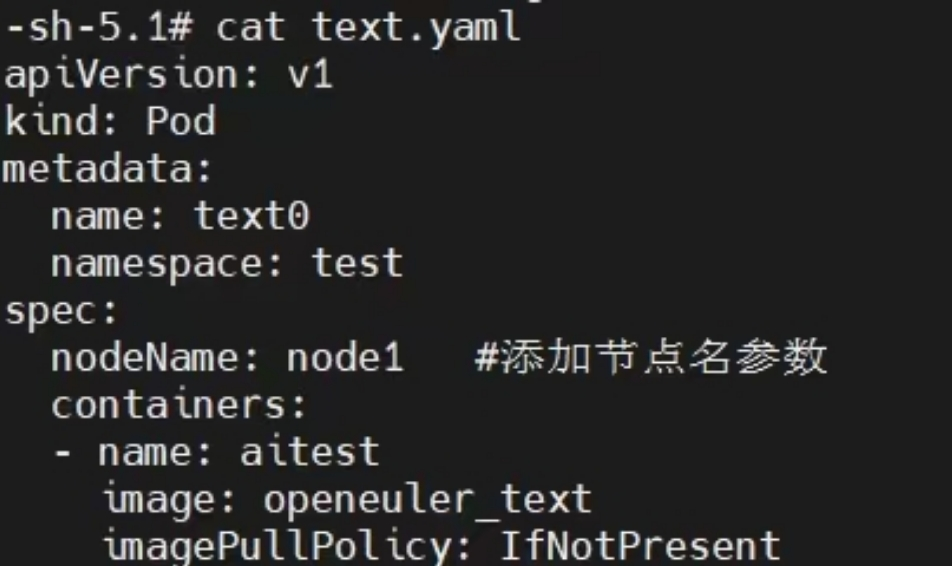
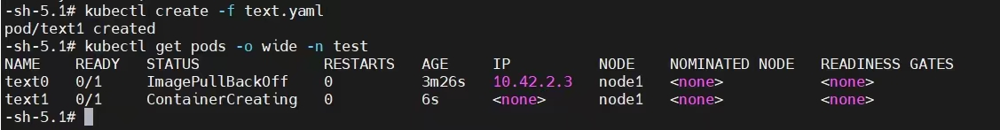
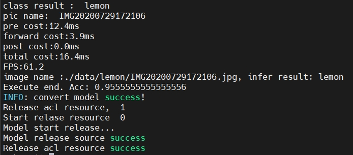
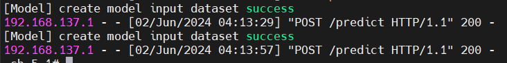

# 构建基于异构嵌入式计算机集群的serverless框架
本项目设计基于serverless框架并将其应用至嵌入式开发板上，嵌入式集群包括负责前端的DAYU200开发板，负责后端调用npu进行推理的Atlas 200I DK A2 开发者套件以及部署了 serverless、k3s 和 isula 的用于集群调度的Atlas 200I DK A2 开发者套件。

## 目标描述
近年来，单板计算机正在越来越普遍的应用于边缘计算的场景中。得益于集成电路技术和芯片生产工艺的高速发展，在功耗有限场景下单板计算机上所能承载的硬件资源越来越丰富，配套的各种计算单元越来越强大，例如 NPU、GPU、FPGA 等。更加丰富的硬件资源使得我们能够在边缘端设备部署标准的操作系统，以及运行对算力需求更高的应用，例如各种AI推理应用和更加复杂的网络通信应用。

由于单板计算机的性能越来越强、配备的硬件资源越来越丰富，且同时较好的控制了体积和功耗，因此将多个不同的单板计算机用网络交换芯片连在一起集成在一块更大的主板上，在边缘端组成一个异构的 SBC 集群成为可能。这样的一个 SBC 集群能够在边缘端作为一个小型的数据中心，为周围的物联网设备提供丰富的算力。与传统的数据中心相比，SBC 集群占地面积小、功耗更小、成本更低，这使得更加灵活的部署方式成为可能。我们完全可以将多个异构的SBC集成在一块较大的移动设备（例如一个平板电脑）上，构建一个可移动的小型数据中心，这意味着在边缘端快速部署一个以往只能在数据中心实现的任务成为可能，且由于SBC距离边缘端设备更近，应用的响应也会更加及时，能够较好的满足物联网场景下的实时性要求。

然而，相较于传统大型数据中心，SBC 集群的资源和功耗仍是相对有限的，面对纷杂的各类新型应用，如何在 SBC 集群中对硬件资源进行合理的调度和分配，仍然是需要解决的问题。我们希望在一个异构的 SBC 集群上构建一套轻量化的、满足物联网应用需求的 serverless 服务框架，为智能物联网设备提供各种计算服务。

## 比赛题目分析和相关资料调研
我们将要组成实际的可运行在单板计算机集群上的 serverless 服务原型框架。前端开发板调用系统相册选择图片，被选中的图片会显示在屏幕上并发送至集群调度的开发板上，该开发板会将此图片发送至调用 NPU 推理的开发板进行图像识别，负责推理的开发板将识别后的结果返回至集群调度的开发板，由此开发板再将识别结果传输给前端开发板，显示在前端开发板的屏幕上。至此完成整个嵌入式开发板集群的调度和应用。如图所示开发板间的基本传输和调用关系。



## 系统框架设计
- 前端开发板：部署鸿蒙系统，开发一个前端程序来调用后端服务。
- 集群调度开发板：安装 isula 和 k3s，k3s 将 isula 作为容器运行时，serverless 则选择使用 openFaas，并部署在 k3s 集群上。
- NPU 推理开发板：部署 OpenEuler 操作系统，同时部署 docker 容器进行推理。

具体系统框架设计如下图所示：

## 开发计划
### 1. 前端开发板
使用搭载了Rockchip RK3568 芯片的润和 HH-SCDAYU200 开发板作为前端开发板。在此开发板上部署鸿蒙系统，并开发一个实现选择图片并传输的功能的 APP。

### 2. 集群调度开发板
使用 Atlas 200I DK A2 开发者套件部署 serverless，k3s 和 isula 等系统，对接受的信息进行分析，并调用合适的系统进行资源调度。

### 3. NPU推理开发板
使用 Atlas 200I DK A2 开发者套件部署 docker 并利用容器进行 NPU 推理。

## 比赛过程中的重要进展
### 1. 前端开发板
使用 open Harmony 进行前端开发，采用基于 api9 的 ArkTS Stage 模型。

通过 `@ohos.file.picker` 模块中的接口成功调用系统相册，`@ohos.file.fs` 接口实现图片文件的选择拷贝等功能。`@ohos.request`和`@ohos.net.http`模块中的接口成功实现http传输。实现效果如下图所示



项目路径 `DAYU200/App`

### 2. 集群调度开发板
使用 Atlas 200I DK A2 开发者套件部署 serverless，k3s 和 isula 等系统，并调度不同的 pod。

#### 部署 isula

直接使用指令 `sudo yum install -y iSulad` 进行 isula 的部署。

#### 部署 k3s

首先使用如下指令，在 server 端部署 k3s：

```shell
curl -sfL https://rancher-mirror.rancher.cn/k3s/k3s-install.sh | INSTALL_K3S_MIRROR=cn sh -
```

然后使用如下指令在 node 端部署 k3s：

```shell
# server端
cat /var/lib/rancher/k3s/server/node-token
ifconfig

# node端
curl -sfL https://rancher-mirror.rancher.cn/k3s/k3s-install.sh | INSTALL_K3S_MIRROR=cn K3S_URL=https://myserver:6443 K3S_TOKEN=mynodetoken sh -
```

运行结束后，即可将 node 加入 k3s 集群。

注意 server 和 node 的时间必须一致。

之后，使用如下 yaml 文件的内容进行 pod 调度测试：

```yaml
apiVersion: v1
kind: Pod
metadata:
  name: test1
  labels:
    env: test
spec:
  nodeName: node1
  containers:
  - name: nginx
    image: nginx:latest
    imagePullPolicy: IfNotPresent
```

#### 部署 serverless

使用如下指令进行 serverless 的部署：

```shell
git clone https://github.com/openfaas/faas-netes

cd faas-netes

kubectl apply -f namespaces.yml

kubectl -n openfaas create secret generic basic-auth \
    --from-literal=basic-auth-user=admin \
    --from-literal=basic-auth-password=admin
    
kubectl apply -f ./yaml/

kubectl get service -n openfaas
```

部署成功后即可进行访问。

### 3. NPU 推理开发板
#### 采用 Ascend Docker Runtime 进行容器化支持
Ascend Docker Runtime（又称 Ascend Docker，又称昇腾容器运行时）是 MindX DL 的基础组件，用于为所有的训练或推理作业提供昇腾 AI 处理器（Ascend NPU）容器化支持，使用户 AI 作业能够以 Docker 容器的方式平滑运行在昇腾设备之上，Ascend Docker Runtime 逻辑接口如图所示

部署参考[异腾社区-官网-Ascend Docker Runtime](https://www.hiascend.com/document/detail/zh/mindx-dl/500/dockerruntime/dockerruntimeug/dlruntime_ug_005.html)



#### 部署 docker 并制作 image
与 docker 进行配套使用，可以轻松被拉起 docker 容器进行容器化推理，为满足环境要求，制作了满足推理环境的 docker image，dockerfile见 `atlas/dockerfile.txt`，容器挂载设备命令见`atlas/build.txt`

#### 调用 NPU 设备进行推理
1.fruit推理程序。

为测试图像推理正确度，使用开发者套件的模型适配工具进行开发，训练了一个水果分类的图像分类模型，构建了一个包含约50张水果图片进行测试，分别为苹果、香蕉、柠檬、橘子。

项目代码见 `atlas/edge_infer.tar`

推理完整过程参考[异腾社区-官网-模型推理](https://www.hiascend.com/document/detail/zh/Atlas200IDKA2DeveloperKit/23.0.RC2/Getting%20Started%20with%20Application%20Development/iaqd/iaqd_0010.html)

推理分类结果储存在 cls_output.txt 文件。

2.yolov5-infer推理程序。

根据yolov5模型制作了一个图像推理程序，使用python所编写的Flask框架实现http接口支持，便于接收前端开发板提供的图片并调用容器内部的推理程序进行分析，将分析结果返回。

项目代码见`yolov5-infer/infer`


## 系统测试情况
### 1. 前端开发板
前端APP选择图片并显示在屏幕上，点击发送照片按钮提交图片至集群调度开发板，集群调度开发板将http请求发送给NPU推理开发板进行推理并得到结果，最后前端开发板得到返回的推理结果显示在屏幕上。

测试视频如下所示：

[前端测试](https://gitlab.eduxiji.net/T202410055992538/project2210132-240344/-/blob/main/image/video.mp4)


<video controls src="image/video.mp4" title="Title" style="zoom: 40%;"></video>
### 2. 集群调度开发板


- 根据写好的yaml进行 pod 调度测试

​

- 远程容器创建

​

### 3. NPU推理开发板
- fruit推理结果显示如下：

​

- http传输日志显示如下:

​


## 遇到的主要问题和解决方法
### NPU 推理无法在容器内进行
容器内进行 NPU 推理时总会显示设备异常，环境异常等。将相关设备和文件利用 Ascend Docker Runtime 全部挂载到容器内，便可以调用开发板上的设备和相关程序进行NPU推理。
### docker 无法拉取 OpenEuler 镜像
不能使用命令 `docker pull openeuler` 拉取镜像。 进入官网下载 OpenEuler 的 tar 镜像包手动导入 docker 。

### 前端开发版本差异
前端开发时，由于开发板最初烧录的操作系统版本为 open Harmony 3.1 Release，支持 api8，而开发集成环境DevEco Studio 仅支持 api9 和 api10，所以前端开发的项目无法在开发板上运行。对开发板重新烧录了 open Harmony 3.2 Beta 版本的api9的操作系统，问题解决。

### k3s 无法将 isula 作为容器运行时

k3s 包含并默认为 containerd，一个行业标准的容器运行时。如果需要使用 docker 则可以使用指令直接进行切换，但是对于使用 isula 并没有相似的指令。所以我们使用如下指令对 k3s 进行额外的配置：

```
# vi /etc/systemd/system/k3s-agent.service
# ExecStart=/usr/local/bin/k3s \
      agent \
      --kubelet-arg container-runtime-endpoint=unix:///var/run/isulad.sock \
      --kubelet-arg image-service-endpoint=unix:///var/run/isulad.sock \
      --kubelet-arg container-runtime-remote
# systemctl daemon-reload   // 重载配置
# systemctl restart k3s-agent
```

使用如上指令可以将 k3s 的容器运行时设置为 isula（需要提前下载好 isula）。

## 分工和协作
### 王荣熙同学
主要负责集群调度开发板的 serverless、k3s 和 isula 的部署和资源调度等工作。
### 岳志鑫同学
主要负责 NPU 推理开发板的 docker 部署，image 制作，环境配置和制作推理程序等工作。
### 李嘉爽同学
主要负责前端开发板的鸿蒙系统的部署和 app 开发等工作。
## 提交仓库目录和文件描述
### Atlas 200I DK A2
#### build.txt
```
将相关设备和文件利用 Ascend Docker Runtime 全部挂载到容器内的 docker 构建语句。
```
#### dockerfile.txt
```
制作包含所有运行环境和库文件的 docker image语句。
```
#### enge_infer
```
enge_infer.tar:是压缩包，便于直接上传至开发板解压使用。
edge_infer/atc.sh:执行命令`bash atc.sh`进行模型转换，获得om模型。
edge_infer/run.sh:执行命令`bash run.sh`进行推理。
edge_infer/infer.py:推理主程序。
edge_infer/atc_model.py:atc库、模型等文件。
```
#### openEuler-docker.aarch64.tar.xz
```
官网下载的应用于 docker 的 openEuler 22.03 LTS SP3 的 tar 镜像包。
```
#### openEuler.repo
```
与 dockerfile 配套使用，用于更换 OpenEuler 的 yum 源
```
### DAYU200
#### App
```
主要代码位于 /App/entry/src/main/ets/pages/index.ets中。
更改权限代码位于 App/entry/src/main/module.json中。
```
### image
```
存放 README 文件中插入的示意图片
```
### faas-netes-master
```
所使用的开源 serverless 框架 openFaas
```
### k3s-master
```
所使用的 k3s 开源代码
```
### yolov5-infer
#### infer
```
infer/main.py：实现推理，
infer/coco_names.txt：存放图像推理的标签
```
#### Dockerfile
```
制作包含所有运行环境和库文件的 docker image语句。
```
#### repo.txt
```
与 Dockerfile 配套使用，用于更换 OpenEuler 的 yum 源
```
### yolov5-infer-k3s-deploy
```
yolov5-infer程序在k3s集群中部署
```

## 比赛收获
对于此次比赛，我们最初是凭着操作系统课程的理论知识的掌握和对操作系统的热情参加，但是在项目进展过程中，才初步了解了嵌入式开发板的开发过程，跟我们之前所想象的有很大的差异。

我们的项目主题是构建基于异构嵌入式计算机集群的 serverless 框架，在基础方面，我们的嵌入式开发板的使用得到了提升，由于本科阶段的学习还大部分存在理论层面，因此这种对于硬件设备的直接使用的经历显得弥足珍贵，我们在使用时也出现了很多问题，经过大家不屑的学习努力也都得到了解决。对于异构云、云原生和 serverless 等知识可谓是没有多少了解，也是随着项目的进展才逐渐了解并深入学习，填补了我们这方面专业知识的空缺。

经过这次比赛，无论结果如何，这段时间的学习也让我们受益匪浅，这段经历受用终身。